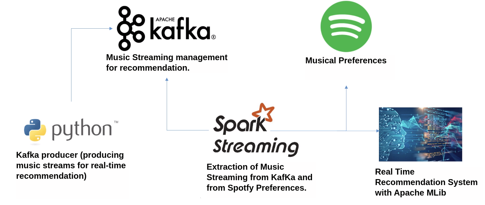

# Reall-time Music Recommendation System

In this project, a Real Time Recommendation System was built using PySpark, Spark Streaming and Kafka. The objective is to recommend music according to the preferences of users on Spotfy, but the project can be modified to recommend other products or services.

For this, 2 data streams were used:
* Stream 1 – dataset with thousands of songs. From this dataset, songs will be recommended for the user. The data is taken from the link below:

https://research.atspotify.com/datasets

* Stream 2 – The user's music preferences will be extracted directly from Spotify with the free API provided by the company.

## Tools and APIs used in this project

* Python with jupyter notebook using Anaconda which simplifies package management.

* Apache Kafka for data streaming management, being an abstraction and management layer that facilitates scalability, fault tolerance and efficient processing of large volumes of data in real time.

* Docker being a lighter and more efficient alternative to traditional virtual machines, allowing applications to run in independent containers, sharing the same kernel as the host operating system. This results in less resource overhead and faster application deployment.

* Spotfy web API to extract user music preferences.

### Creating Docker Containers for the Apache Kafka Cluster

After cloning the repository, Apache Kafka can be installed using a docker container. Having docker installed, follow the steps described in the file `01-create_containers_docker.txt` to create docker containers for the Apache KafKa cluster.

This will run the script from the 'docker-compose.yml' file, which contains instructions for creating two docker containers:

1. zookeeper: This container will act as the Kafka cluster manager.

2. kafka: This container will contain the Kafka cluster with a single broker and will provide a log file to record streaming data.

The 'kafka' service depends on the 'zookeeper' service, ensuring that the zookeeper container is running before starting the Kafka cluster.

Ports 2181 and 9092 are being mapped to host ports so you can access Docker services outside of containers."

### Creating Topic in Apache Kafka

A topic in Apache Kafka is a category of messages or a "log file" that is managed by the Kafka service. When we send messages to this topic through a producer, which was created in Python, the messages are stored in the topic. A consumer, on the other hand, implemented using Apache Spark Streaming, can consume the topic's messages to process them as needed.

Apache Kafka acts as a distributed messaging system, allowing different components of a system to communicate asynchronously and efficiently across threads. Topics can have multiple partitions, which allows for scalability and parallel processing of messages.

Thus, when using a producer in Python to send messages to the topic in Kafka, you can later process them through a consumer with Spark Streaming or any other technology that supports reading streaming data from Kafka. This approach is widely used in real-time data and processing architectures, allowing the creation of scalable and fault-tolerant data pipelines.

Execute in the terminal the commands present in the file `02-create_and_list_topic_kafka.txt` to create and view the Kafka topic.
